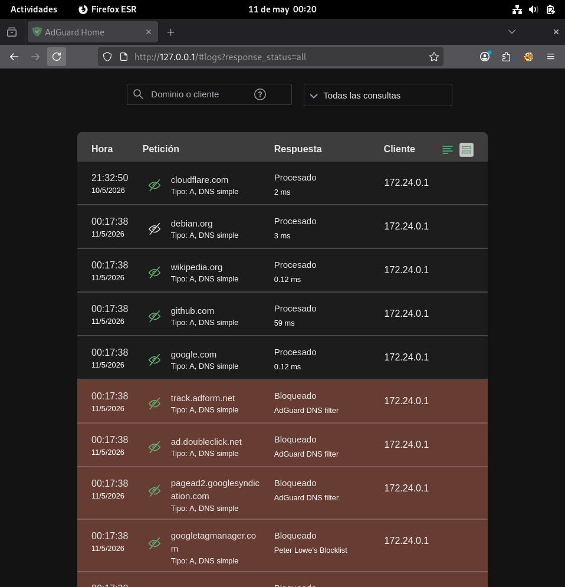
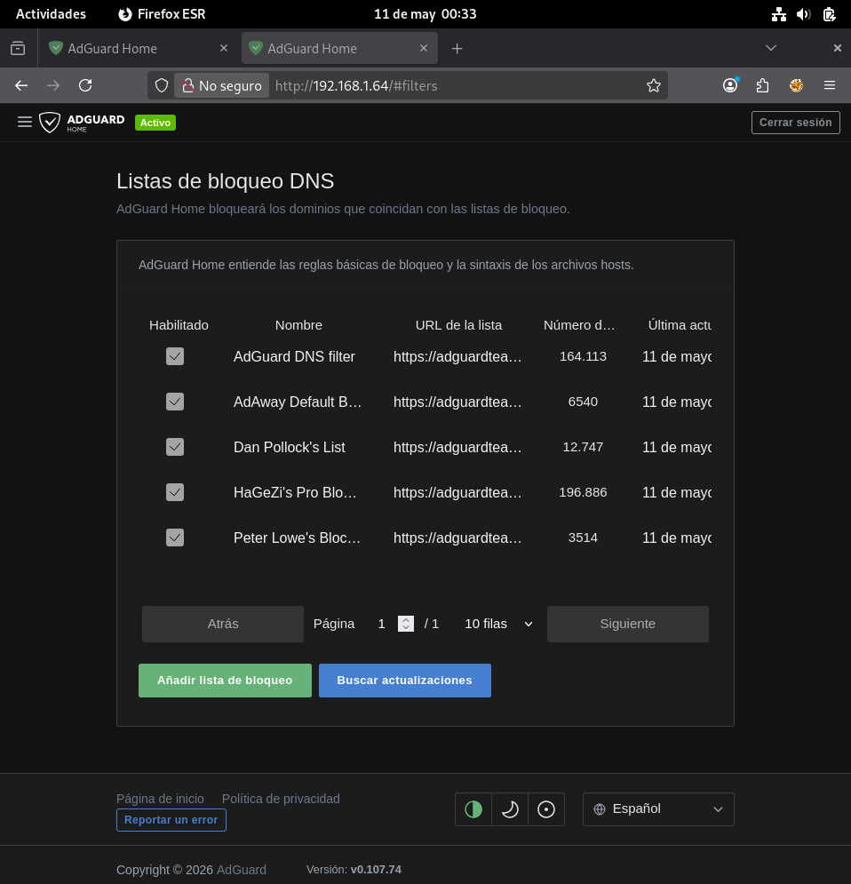
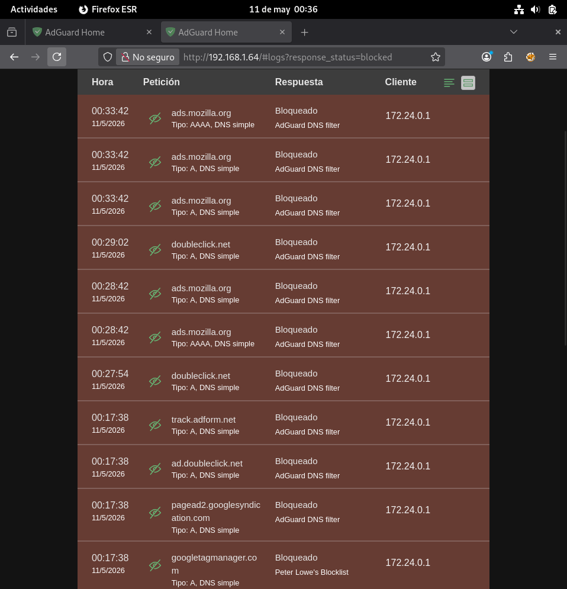
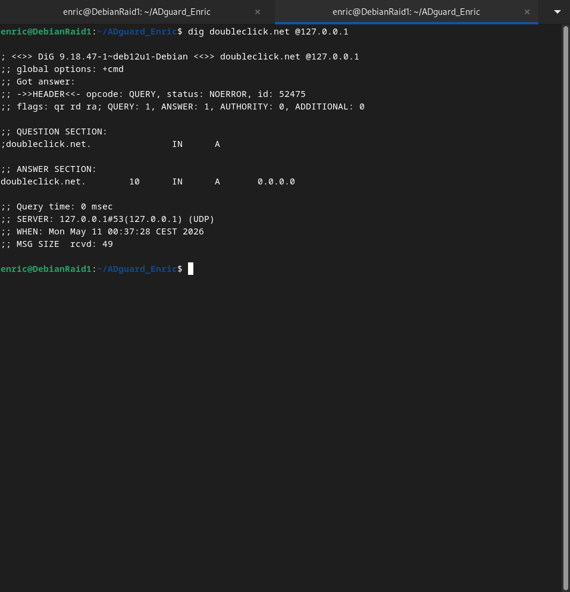
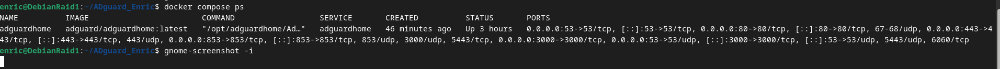

# ADguard_Enric
 
---
 
## Descripció
 
Desplegament d'**AdGuard Home** mitjançant Docker Compose en una màquina virtual Debian (VirtualBox). AdGuard Home actua com a servidor DNS amb filtratge a nivell de xarxa, bloquejant publicitat, rastreig i dominis maliciosos abans que arribin als clients.
 
### Per què AdGuard Home en un mòdul de Tallafocs?
 
| Funció de Tallafoc | Com ho fa AdGuard Home |
|---|---|
| Filtratge de tràfic | Bloqueja consultes DNS per política (blocklists) |
| Registre i monitorització | Dashboard amb estadístiques en temps real |
| Ubicació a la xarxa | Servei centralitzat per a tots els clients |
| Llistes de regles | Blocklists = directives ACCEPT/DROP per domini |
 
---
 
## Arquitectura
 
```
Client (navegador)
        │
        ▼ consulta DNS (port 53)
┌───────────────────┐
│   AdGuard Home    │  ◄── Docker Container
│  (DNS Filtre)     │       adguard/adguardhome
│                   │
│  ┌─────────────┐  │
│  │ Blocklists  │  │  ← EasyList, AdGuard, etc.
│  └─────────────┘  │
└───────────────────┘
        │
        ├── Domini BLOQUEJAT → retorna 0.0.0.0
        │
        ▼ Domini permès
   DNS real (8.8.8.8 / 1.1.1.1)
        │
        ▼
     Internet
```
 
---
 
## Captures de pantalla — Demostració visual
 
### 1. Dashboard d'AdGuard Home amb estadístiques
 
Panell de control mostrant les consultes DNS totals, les consultes bloquejades pels filtres
i el temps mitjà de processament.
 
> Ubicació de la captura: `screenshots/01-dashboard.png`
 

 
---
 
### 2. Llistes de bloqueig actives
 
Pàgina **Filtros → Listas DNS de bloqueo** amb les blocklists activades i el nombre
de regles que aporta cadascuna.
 
> Ubicació de la captura: `screenshots/02-blocklists.png`
 

 
---
 
### 3. Query Log amb consultes bloquejades
 
Registre de consultes DNS mostrant en **vermell** els dominis bloquejats (publicitat,
tracking) i en **verd** els dominis legítims permesos.
 
> Ubicació de la captura: `screenshots/03-query-log.png`
 

 
---
 
### 4. Demostració del bloqueig amb `dig`
 
Sortida del comando `dig doubleclick.net @127.0.0.1` mostrant que el domini de
publicitat retorna **`0.0.0.0`** — és a dir, AdGuard Home l'està bloquejant correctament.
 
> Ubicació de la captura: `screenshots/04-dig-bloqueig.png`
 

 
---
 
### 5. Contenidor Docker en funcionament
 
Sortida de `docker compose ps` mostrant el contenidor `adguardhome` amb estat **`Up`**
i els ports correctament mapejats (53, 80, 3000, 443, 853).
 
> Ubicació de la captura: `screenshots/05-docker-ps.png`
 

 
---
 
## Desplegament
 
### Iniciar AdGuard Home
 
```bash
# Aixecar el contenidor
docker compose up -d
 
# Verificar que funciona
docker compose ps
docker compose logs -f adguardhome
```
 
### Configuració inicial (Setup Wizard)
 
Obre el navegador i accedeix a:
 
```
http://<IP-de-la-MV>:3000
```
 
**Passos del wizard:**
1. **Welcome** → Clic a *Get Started*
2. **Admin Web Interface** → Port `80`, totes les interfícies
3. **DNS Server** → Port `53`, totes les interfícies
4. **Authentication** → Crea usuari i contrasenya d'administrador
5. **Configure your devices** → Anota la IP per configurar el DNS
Després del setup, el panell és accessible a:
```
http://<IP-de-la-MV>:80
```
 
---
 
## Configuració del DNS a la màquina Debian
 
Un cop AdGuard Home funciona, configura la MV per usar-lo com a DNS:
 
### Mètode 1: Modificar resolv.conf directament
 
```bash
sudo nano /etc/resolv.conf
```
 
Contingut:
```
nameserver 127.0.0.1
```
 
### Mètode 2: Configuració permanent amb NetworkManager
 
```bash
# Editar la connexió de xarxa
sudo nmcli con mod "nom-connexio" ipv4.dns "127.0.0.1"
sudo nmcli con mod "nom-connexio" ipv4.ignore-auto-dns yes
sudo nmcli con up "nom-connexio"
 
# Verificar
nmcli con show "nom-connexio" | grep dns
```
 
### Verificar que AdGuard resol les consultes
 
```bash
# Consulta normal (ha de resoldre)
dig google.com @127.0.0.1
 
# Consulta a domini de publicitat (ha de bloquejar)
dig ads.google.com @127.0.0.1
# Resposta esperada: 0.0.0.0
```
 
---
 
## Llistes de Bloqueig Actives
 
A **Filters → DNS blocklists**, s'han activat les següents llistes:
 
| Llista | Descripció | Dominis aprox. |
|--------|------------|----------------|
| AdGuard DNS filter | Llista principal d'AdGuard | ~50.000 |
| EasyList | Publicitat web general | ~60.000 |
| EasyPrivacy | Rastreig i analítica | ~30.000 |
| MalwareDomainList | Dominis maliciosos | ~15.000 |
| AdAway Default Blocklist | Publicitat en apps mòbils | ~10.000 |
 
### Per afegir una llista personalitzada:
 
1. Ves a **Filters → DNS blocklists**
2. Clic a **Add blocklist**
3. Introdueix la URL de la llista
4. Clic a **Save**
---
 
## Demostració de Bloqueig
 
### Test de bloqueig amb dig
 
```bash
# Domini de publicitat - HA DE RETORNAR 0.0.0.0
dig doubleclick.net @127.0.0.1
dig ads.google.com @127.0.0.1
dig googletagmanager.com @127.0.0.1
dig pagead2.googlesyndication.com @127.0.0.1
 
# Domini legítim - HA DE RESOLDRE CORRECTAMENT
dig google.com @127.0.0.1
dig github.com @127.0.0.1
dig wikipedia.org @127.0.0.1
```
 
**Resultat esperat per domini bloquejat:**
```
;; ANSWER SECTION:
doubleclick.net.    3600  IN  A  0.0.0.0
```
 
### Test des del navegador
 
1. Obre Firefox/Chromium a la MV
2. Accedeix a una pàgina amb publicitat (ex: un diari online)
3. Comprova el Dashboard d'AdGuard: les peticions bloquejades apareixeran en vermell
---
 
## Dashboard - Estadístiques
 
El Dashboard d'AdGuard mostra en temps real:
 
- **Total consultes DNS** processades
- **Consultes bloquejades** (% i nombre absolut)
- **Temps de resposta** mitjà
- **Top dominis** consultats i bloquejats
- **Top clients** actius
- **Gràfic temporal** de consultes
---
 
## Decisions de Configuració
 
### Per què els ports exposats?
 
| Port | Protocol | Funció |
|------|----------|--------|
| 53 | TCP/UDP | Servei DNS estàndard |
| 80 | TCP | Panell web (post-setup) |
| 443 | TCP | HTTPS per al panell |
| 853 | TCP | DNS sobre TLS (DoT) |
| 3000 | TCP | Setup wizard inicial |
 
### Llistes triades: criteris
 
1. **AdGuard DNS filter** → llista oficial, ben mantinguda, equilibri bloqueig/usabilitat
2. **EasyList + EasyPrivacy** → estàndard de la indústria, gran cobertura
3. **MalwareDomainList** → seguretat addicional contra dominis maliciosos
---
 
## Estructura del Projecte
 
```
ADguard_Enric/
├── docker-compose.yml      # Definició del servei Docker
├── README.md               # Aquesta documentació
├── setup.sh                # Script de desplegament automatitzat
├── test_bloqueig.sh        # Script per verificar el filtratge DNS
├── .gitignore              # Exclusions de git
├── adguard_conf/           # Configuració persistent (generat per Docker, no pujat)
│   └── AdGuardHome.yaml
├── adguard_work/           # Dades de treball (generat per Docker, no pujat)
│   └── data/
│       └── querylog.json
└── screenshots/            # ⭐ AQUÍ van les captures de pantalla
    ├── 01-dashboard.png        ← Panell de control
    ├── 02-blocklists.png       ← Llistes de bloqueig
    ├── 03-query-log.png        ← Query log amb bloqueigs
    ├── 04-dig-bloqueig.png     ← Test de bloqueig amb dig
    └── 05-docker-ps.png        ← Estat del contenidor
```
 
---
 
## Comandos útils
 
```bash
# Iniciar els serveis
docker compose up -d
 
# Aturar els serveis
docker compose down
 
# Veure logs en temps real
docker compose logs -f adguardhome
 
# Reiniciar el contenidor
docker compose restart adguardhome
 
# Veure estat dels contenidors
docker compose ps
 
# Entrar al contenidor (shell)
docker compose exec adguardhome sh
 
# Actualitzar la imatge
docker compose pull
docker compose up -d
```
 
---
 
## 🔗 Recursos
 
- [AdGuard Home GitHub](https://github.com/AdguardTeam/AdGuardHome)
- [Imatge Docker oficial](https://hub.docker.com/r/adguard/adguardhome)
- [Documentació oficial](https://adguard-dns.io/kb/adguard-home/overview/)
- [Docker Compose docs](https://docs.docker.com/compose/)
---
 
*Enric Tasies Gabernet · enrictasiesgabernet-ux · 2026*
